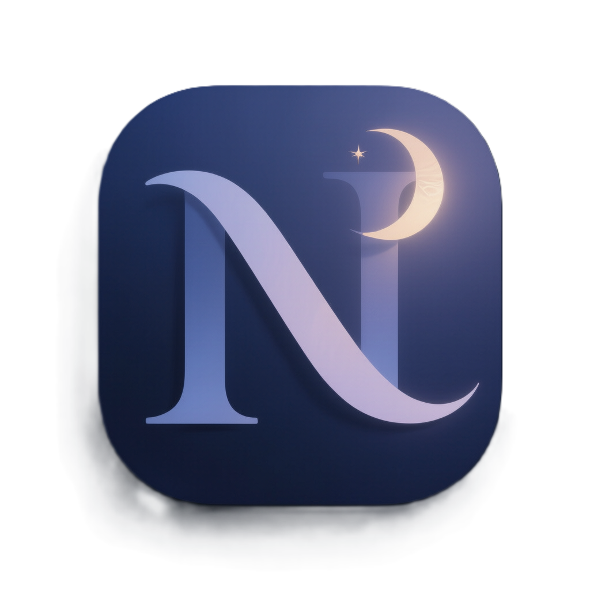
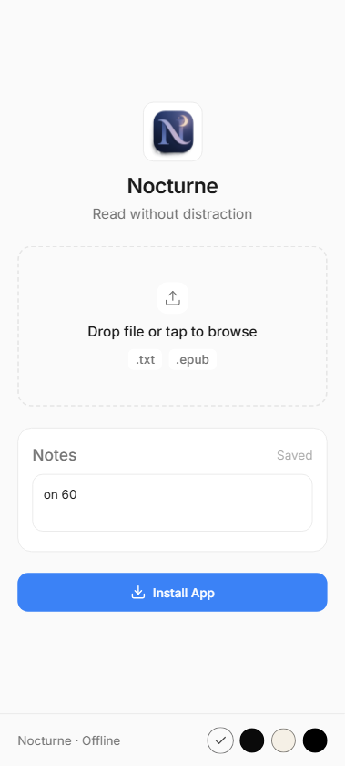
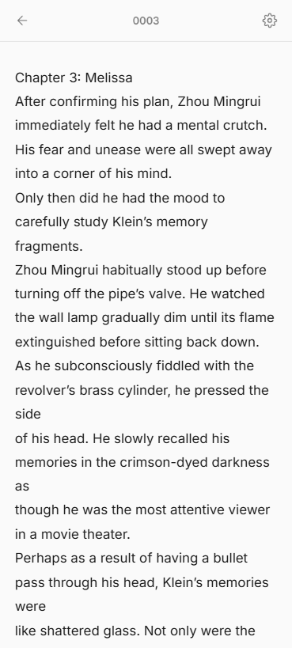
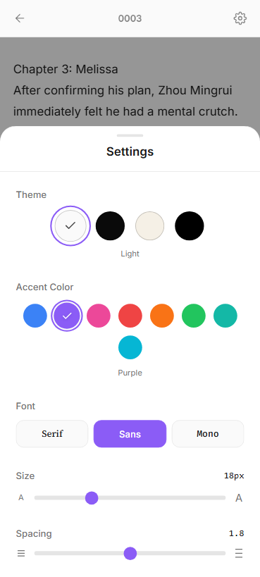

  
  
  # 🌙 Nocturne
  
  **A calm, distraction-free reader built for novel chapters and late-night reading.**
  
  Upload a TXT or EPUB. Read. Close. Nothing stored. Ever.

[Live Demo](https://nocturne-opal.vercel.app) • [Features](#-features) • [Installation](#-installation) • [Tech Stack](#-tech-stack)

---

## ✨ Features

### 📖 Reading Experience

- **Drag & Drop Upload** — Drop a file or tap to browse
- **TXT & EPUB Support** — Built specifically for novel chapters
- **Comfortable Typography** — Adjust font size, line height, and font family
- **Multiple Fonts** — Serif, Sans (Inter), or Mono (Fira Code)
- **Distraction-Free UI** — Controls stay out of the way while reading

### 🎨 Theming

- **4 Themes** — Light, Dark, Sepia, and AMOLED
- **Accent Colors** — Subtle personalization without distraction
- **Smooth Transitions** — Easy on the eyes when switching themes

### 📱 Mobile First

- **PWA Support** — Install and use like a native app
- **Offline Ready** — Works without internet once loaded
- **Gesture Friendly** — Swipe back, pull to refresh, touch-optimized UI

### 🔒 Privacy Focused

- **No Cloud** — Nothing leaves your device
- **Temporary by Design** — Content disappears when you close the tab

### 📝 Personal Notes

- **Persistent Notes** — Jot down thoughts on the home page
- **Auto-save** — Notes save automatically to localStorage
- **Session Independent** — Notes persist across reading sessions

---

## 🌓 Philosophy

- Nocturne is designed for reading, not managing files.

- There are no accounts, no libraries, and no syncing.  
  You open a chapter, read it, and close it. That’s it.

- The app stays quiet so the story doesn’t have to.

---

## 📸 Screenshots

  <table>
    <tr>
      <td align="center">
        
         
        <b>Mobile Home</b>
      </td>
      <td align="center">
        
         
        <b>Mobile — Reader</b>
      </td>
      <td align="center">
        
         
        <b>Mobile - Setting</b>
      </td>
    </tr>
  </table>

---

## 🛠 Tech Stack

| Technology                                    | Purpose                         |
| --------------------------------------------- | ------------------------------- |
| [Next.js](https://nextjs.org/)                | React framework with App Router |
| [React](https://react.dev/)                   | UI library                      |
| [TypeScript](https://www.typescriptlang.org/) | Type safety                     |
| [Tailwind CSS](https://tailwindcss.com/)      | Styling                         |
| [JSZip](https://stuk.github.io/jszip/)        | EPUB parsing                    |

---

## 🌐 PWA Installation

### On Mobile (Android)

1. Open [nocturne-opal.vercel.app](https://nocturne-opal.vercel.app)
2. Tap the **"Install App"** button on the home page
3. Confirm the installation

### On Mobile (iOS)

1. Open in Safari
2. Tap the **Share** button
3. Scroll down and tap **"Add to Home Screen"**
4. Tap **"Add"**

### On Desktop (Chrome)

1. Open [nocturne-opal.vercel.app](https://nocturne-opal.vercel.app)
2. Click the install icon in the address bar
3. Click **"Install"**

---

## 🤝 Contributing

Contributions are welcome! Feel free to:

1. Fork the repository
2. Create a feature branch (`git checkout -b feature/amazing-feature`)
3. Commit your changes (`git commit -m 'Add amazing feature'`)
4. Push to the branch (`git push origin feature/amazing-feature`)
5. Open a Pull Request

---

## 📄 License

This project is open source and available under the [MIT License](LICENSE).

---

**Made with 🌙 for late-night readers**

[⬆ Back to Top](#-nocturne)

